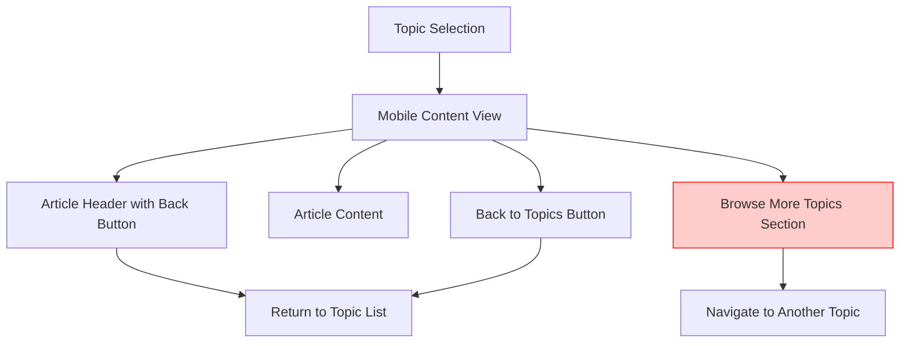
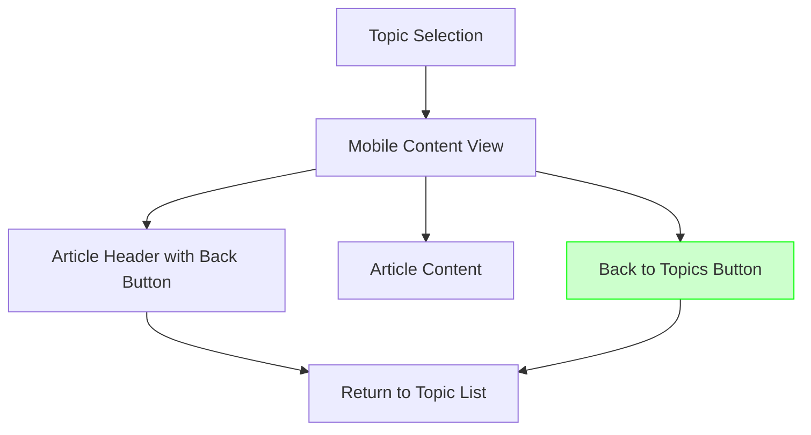

# Clean Navigation UI Design

## Overview

This design addresses the redundancy in the mobile navigation experience by removing the "Browse More Topics" section that appears after article content. With "Back" and "Back to Topics" buttons already providing clear navigation paths, this section creates unnecessary clutter and cognitive load for readers.

## Problem Statement

Currently, when users read an article on mobile, they encounter three navigation options:
1. **Back** button (top of article)
2. **Browse More Topics** section (after article content) 
3. **Back to Topics** button (bottom sticky navigation)

This creates redundancy since users who want to search or browse topics can simply use the "Back to Topics" button to return to the main navigation interface with search functionality.

## Architecture

### Current Mobile Content Flow



### Proposed Mobile Content Flow



## Component Changes

### Mobile Content Area Structure

#### Current Structure
```
mobile-content-area
├── mobile-content-header (Back button)
├── mobile-content-wrapper (Article content)
├── mobile-topics-section (Browse More Topics) ← REMOVE
│   ├── topics-section-header
│   └── topics-list-container
└── mobile-bottom-navigation (Back to Topics)
```

#### Proposed Structure
```
mobile-content-area
├── mobile-content-header (Back button)
├── mobile-content-wrapper (Article content)
└── mobile-bottom-navigation (Back to Topics)
```

### HTML Modifications

**Remove from index.html:**
```html
<!-- Mobile Topics Section - appears after content -->
<section class="mobile-topics-section" id="mobileTopicsSection">
  <div class="topics-section-header">
    <h6 class="text-primary fw-bold">📚 Browse More Topics</h6>
  </div>
  <div class="topics-list-container">
    <ul class="mobile-topics-list" id="mobileTopicsList"></ul>
  </div>
</section>
```

### JavaScript Modifications

**Remove from script.js:**
- `populateMobileTopicsList()` function
- Related topic list population logic
- Event handlers for mobile topic cards

### CSS Cleanup

**Remove from style.css:**
- `.mobile-topics-section` styles
- `.topics-section-header` styles  
- `.topics-list-container` styles
- `.mobile-topics-list` styles
- Related hover and transition effects

## User Experience Benefits

### Simplified Navigation Flow
1. **Clearer Intent**: Users have two clear options - continue reading or return to browse topics
2. **Reduced Cognitive Load**: Fewer navigation choices reduce decision fatigue
3. **Faster Loading**: Removing dynamic topic list generation improves performance
4. **Cleaner Design**: More whitespace and focus on article content

### Navigation Path Clarity

| User Intent | Action |
|-------------|--------|
| Continue reading current article | Stay on page |
| Browse/search for different topics | Use "Back to Topics" button |
| Go back to previous view | Use "Back" button |

## Implementation Strategy

### Phase 1: HTML Structure Cleanup
- Remove `mobile-topics-section` from index.html
- Update mobile content layout structure

### Phase 2: JavaScript Optimization
- Remove `populateMobileTopicsList()` function
- Clean up related event handlers and data processing
- Optimize mobile content loading performance

### Phase 3: CSS Simplification
- Remove unused mobile topics styling
- Optimize mobile content area layout
- Ensure proper responsive behavior

## Design Principles Applied

### Minimalism
- Remove unnecessary UI elements
- Focus on core functionality
- Reduce visual noise

### User-Centered Design
- Prioritize reading experience
- Simplify navigation decisions
- Maintain accessibility

### Performance Optimization
- Reduce DOM complexity
- Eliminate unnecessary data processing
- Improve loading times

## Accessibility Considerations

### Keyboard Navigation
- Maintain tab order through simplified navigation
- Ensure all remaining interactive elements are keyboard accessible

### Screen Reader Support
- Remove redundant navigation announcements
- Maintain clear heading hierarchy

### Touch Interaction
- Preserve large touch targets for Back buttons
- Maintain sticky bottom navigation for thumb-friendly access

## Testing Strategy

### Mobile Device Testing
- Verify navigation flow on various screen sizes
- Test touch interaction responsiveness
- Validate scrolling behavior

### Cross-Browser Compatibility  
- Test on iOS Safari, Chrome Mobile, Firefox Mobile
- Verify layout consistency across browsers

### Accessibility Testing
- Screen reader navigation testing
- Keyboard-only navigation testing
- Color contrast validation

## Success Metrics

### User Experience
- Reduced time to complete navigation tasks
- Decreased bounce rate on article pages
- Improved article reading completion rates

### Performance
- Faster mobile content loading
- Reduced JavaScript execution time
- Smaller DOM size

### Design Quality
- Cleaner visual hierarchy
- Better content focus
- Improved readability scores