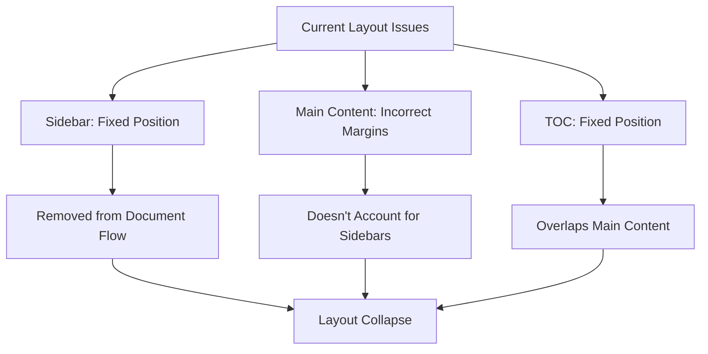
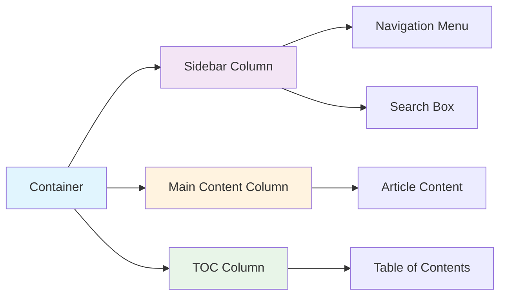
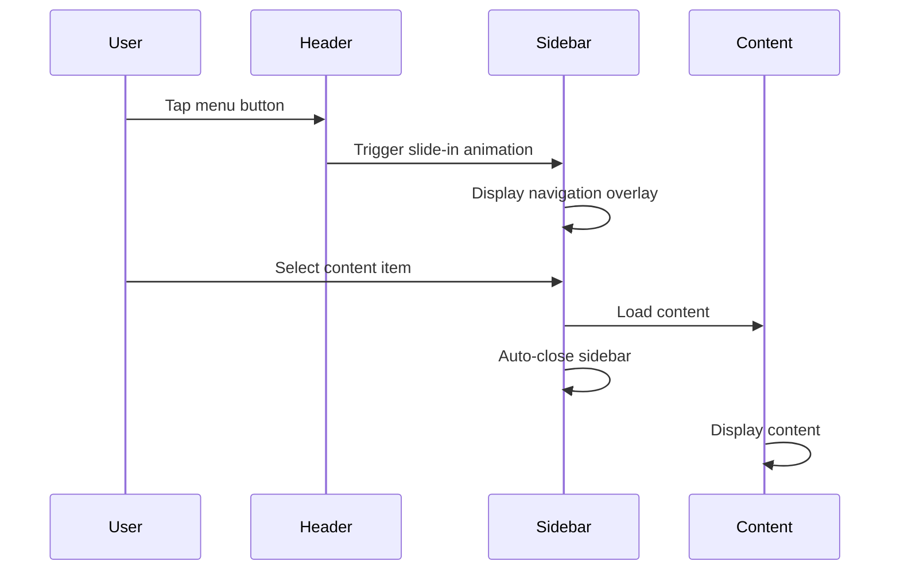

# Grid Layout Repair Design Document

## Overview

This design document addresses the critical grid layout issues in the Active Directory Tech Blog where the sidebar navigation, main content, and table of contents are not properly aligned in a three-column layout similar to Microsoft Docs. The current implementation has structural problems that cause layout collapse and misalignment.

## Current Architecture Issues

### Problem Analysis

The current layout suffers from several structural problems:

1. **Inconsistent Grid Structure**: The Bootstrap grid system is improperly implemented with conflicting column classes
2. **Fixed Positioning Conflicts**: The sidebar and TOC panel use fixed positioning which removes them from the document flow
3. **Responsive Breakpoint Issues**: Column widths don't adapt properly across different screen sizes
4. **Z-index Stacking Problems**: Components overlap incorrectly due to improper layering
5. **Content Flow Disruption**: Main content doesn't properly account for fixed sidebars

### Current Grid Implementation Problems



## Proposed Solution Architecture

### Grid Layout Structure

The solution implements a robust three-column layout using CSS Grid with Bootstrap fallback:



### Responsive Breakpoint Strategy

| Breakpoint | Sidebar | Main Content | TOC Panel | Layout Strategy |
|------------|---------|--------------|-----------|-----------------|
| Mobile (<768px) | Off-canvas | Full width | Modal | Single column with overlays |
| Tablet (768-991px) | Off-canvas | Full width | Float button | Two column with modal TOC |
| Desktop (992-1199px) | Fixed 25% | Flexible 50% | Fixed 25% | Three column grid |
| Large (≥1200px) | Fixed 300px | Flexible max 800px | Fixed 280px | Fixed + flexible hybrid |

## Component Architecture

### HTML Structure Redesign

```html
<body class="layout-container">
  <!-- Mobile Header -->
  <header class="mobile-header">
    <!-- Navigation controls -->
  </header>
  
  <!-- Main Layout Grid -->
  <div class="layout-grid">
    <!-- Sidebar Navigation -->
    <aside class="sidebar-column">
      <nav class="sidebar-nav">
        <!-- Search and navigation -->
      </nav>
    </aside>
    
    <!-- Main Content -->
    <main class="content-column">
      <article class="content-wrapper">
        <!-- Markdown content -->
      </article>
    </main>
    
    <!-- Table of Contents -->
    <aside class="toc-column">
      <nav class="toc-wrapper">
        <!-- TOC navigation -->
      </nav>
    </aside>
  </div>
</body>
```

### CSS Grid Implementation

```css
.layout-grid {
  display: grid;
  grid-template-columns: 
    [sidebar-start] minmax(280px, 300px) 
    [content-start] 1fr 
    [toc-start] minmax(250px, 280px) [toc-end];
  grid-template-areas: "sidebar content toc";
  min-height: 100vh;
  gap: 0;
}

.sidebar-column {
  grid-area: sidebar;
  position: sticky;
  top: 0;
  height: 100vh;
  overflow-y: auto;
}

.content-column {
  grid-area: content;
  min-width: 0;
  max-width: 800px;
  margin: 0 auto;
  padding: 2rem;
}

.toc-column {
  grid-area: toc;
  position: sticky;
  top: 0;
  height: 100vh;
  overflow-y: auto;
}
```

### Responsive Grid Adaptations

```css
/* Tablet Layout */
@media (max-width: 991.98px) {
  .layout-grid {
    grid-template-columns: 1fr;
    grid-template-areas: "content";
  }
  
  .sidebar-column,
  .toc-column {
    display: none;
  }
}

/* Large Desktop Optimization */
@media (min-width: 1400px) {
  .layout-grid {
    grid-template-columns: 
      320px 
      minmax(600px, 900px) 
      300px;
    max-width: 1520px;
    margin: 0 auto;
  }
}
```

## Component Specifications

### Sidebar Navigation Component

**Functionality**:
- Fixed width navigation panel
- Integrated search functionality
- Collapsible categories
- Active state management

**Layout Properties**:
- Width: 280px-320px (responsive)
- Position: Sticky with grid
- Overflow: Auto with custom scrollbar
- Z-index: 100

**Responsive Behavior**:
- Desktop: Visible as grid column
- Mobile/Tablet: Hidden, accessible via off-canvas

### Main Content Component

**Functionality**:
- Responsive content container
- Markdown rendering area
- Optimal reading width
- Scroll position management

**Layout Properties**:
- Max-width: 800px
- Padding: 2rem
- Margin: Auto-centered
- Line-height: 1.6

**Content Flow**:
- Proper heading hierarchy
- Image responsive scaling
- Code block syntax highlighting
- Table responsive design

### Table of Contents Component

**Functionality**:
- Auto-generated from content headings
- Smooth scroll navigation
- Active section highlighting
- Nested hierarchy support

**Layout Properties**:
- Width: 250px-300px
- Position: Sticky with grid
- Max-height: 100vh
- Scroll: Independent

**Interaction Model**:
- Click navigation to sections
- Visual feedback for active items
- Keyboard accessibility support

## Mobile Experience Design

### Off-Canvas Navigation



### Mobile TOC Strategy

**Implementation Approach**:
- Floating Action Button (FAB) when content is loaded
- Modal overlay for TOC navigation
- Touch-optimized tap targets
- Swipe gesture support

**UX Considerations**:
- One-handed operation support
- Clear visual hierarchy
- Fast access to content sections
- Minimal cognitive load

## Performance Optimizations

### CSS Grid Benefits

1. **Hardware Acceleration**: GPU-accelerated layout calculations
2. **Efficient Reflows**: Minimal layout recalculation on resize
3. **Memory Optimization**: Reduced DOM manipulation
4. **Smooth Animations**: Native browser transitions

### JavaScript Optimizations

```javascript
// Efficient layout management
class LayoutManager {
  constructor() {
    this.mediaQueries = {
      mobile: window.matchMedia('(max-width: 767.98px)'),
      tablet: window.matchMedia('(min-width: 768px) and (max-width: 991.98px)'),
      desktop: window.matchMedia('(min-width: 992px)')
    };
    this.initResponsiveHandlers();
  }
  
  initResponsiveHandlers() {
    this.mediaQueries.mobile.addListener(this.handleMobileLayout.bind(this));
    this.mediaQueries.desktop.addListener(this.handleDesktopLayout.bind(this));
  }
  
  handleMobileLayout(mq) {
    if (mq.matches) {
      this.enableMobileMode();
    }
  }
  
  handleDesktopLayout(mq) {
    if (mq.matches) {
      this.enableDesktopMode();
    }
  }
}
```

## Accessibility Compliance

### WCAG 2.1 Requirements

1. **Keyboard Navigation**: Full keyboard accessibility for all interactive elements
2. **Screen Reader Support**: Proper ARIA labels and semantic HTML
3. **Focus Management**: Logical tab order and visible focus indicators
4. **Color Contrast**: Minimum 4.5:1 contrast ratio for text
5. **Responsive Text**: Support for 200% zoom without horizontal scroll

### Implementation Strategy

```html
<!-- Semantic HTML structure -->
<nav aria-label="Main navigation" role="navigation">
  <ul role="menubar">
    <li role="menuitem">
      <a href="#section1" aria-describedby="section1-desc">
        Section Title
      </a>
    </li>
  </ul>
</nav>

<!-- Screen reader announcements -->
<div aria-live="polite" aria-atomic="true" class="sr-only" id="status-announcements">
  <!-- Dynamic content announcements -->
</div>
```

## Microsoft Docs Alignment

### Visual Design Patterns

**Layout Characteristics**:
- Clean three-column structure
- Consistent spacing and typography
- Subtle visual separators
- Professional color scheme

**Interaction Patterns**:
- Smooth scroll navigation
- Persistent navigation context
- Quick access to content sections
- Breadcrumb navigation support

**Content Presentation**:
- Optimal reading experience
- Code syntax highlighting
- Responsive media handling
- Print-friendly styles

### Brand Consistency

**Typography Scale**:
- Primary: Segoe UI system font
- Headings: 1.2 modular scale
- Body: 16px base with 1.6 line-height
- Code: Consolas monospace family

**Color Palette**:
- Primary: #0078d4 (Microsoft Blue)
- Secondary: #6c757d
- Success: #107c10
- Background: #ffffff/#f8f9fa

## Implementation Roadmap

### Phase 1: Core Grid Structure (Priority: High)
- Implement CSS Grid layout foundation
- Update HTML structure for semantic correctness
- Basic responsive breakpoint handling
- Remove conflicting fixed positioning

### Phase 2: Component Integration (Priority: High)
- Sidebar navigation improvements
- TOC component restructuring
- Content area optimization
- Mobile experience enhancement

### Phase 3: Polish and Performance (Priority: Medium)
- Animation and transition improvements
- Accessibility audit and fixes
- Performance optimization
- Cross-browser compatibility testing

### Phase 4: Advanced Features (Priority: Low)
- Dark mode theme consistency
- Print stylesheet optimization
- SEO and meta tag improvements
- Analytics integration points

## Validation Criteria

### Layout Testing Requirements

1. **Cross-Browser Compatibility**: Chrome, Firefox, Safari, Edge
2. **Device Testing**: Mobile, tablet, desktop, large screens
3. **Performance Metrics**: Core Web Vitals compliance
4. **Accessibility Audit**: WAVE and axe-core validation
5. **Visual Regression**: Automated screenshot comparison

### Success Metrics

- **Layout Stability**: Zero cumulative layout shift (CLS)
- **Load Performance**: First Contentful Paint < 1.5s
- **Accessibility Score**: 100% Lighthouse accessibility
- **User Experience**: Task completion rate > 95%
- **Cross-Browser**: Consistent rendering across all targets

## Risk Mitigation

### Potential Issues and Solutions

1. **Legacy Browser Support**: Provide CSS Grid fallback using flexbox
2. **Content Overflow**: Implement horizontal scroll prevention
3. **Performance Impact**: Use CSS containment for layout optimization
4. **Mobile Compatibility**: Progressive enhancement approach
5. **Accessibility Regression**: Automated testing in CI/CD pipeline

This design ensures a robust, scalable, and accessible three-column layout that mirrors the professional appearance and functionality of Microsoft Docs while maintaining optimal performance across all devices and browsers.