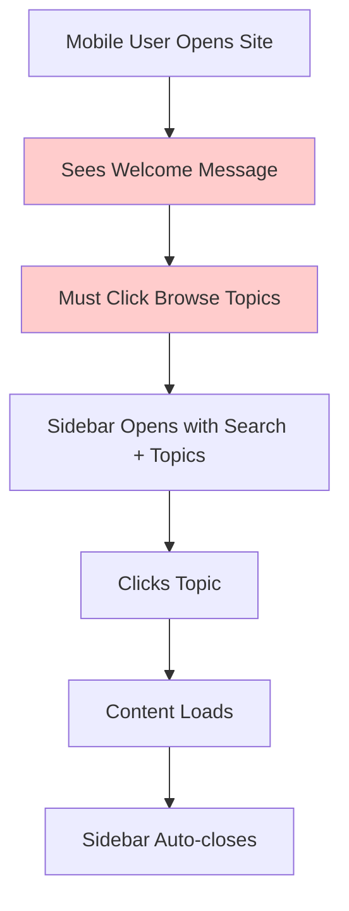
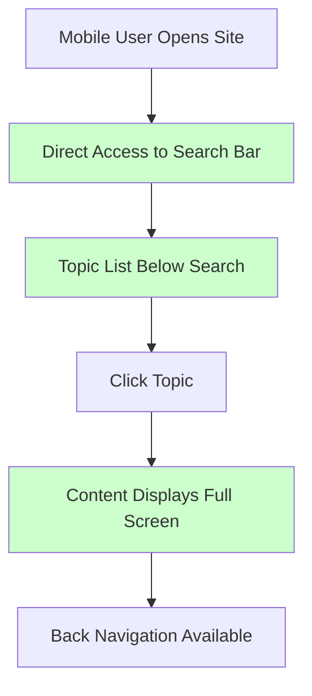
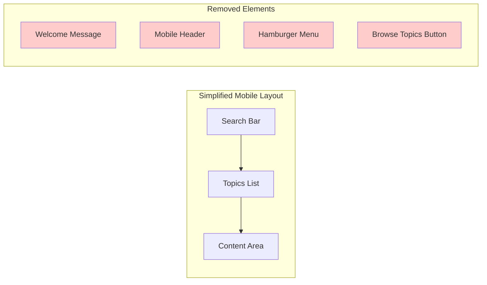
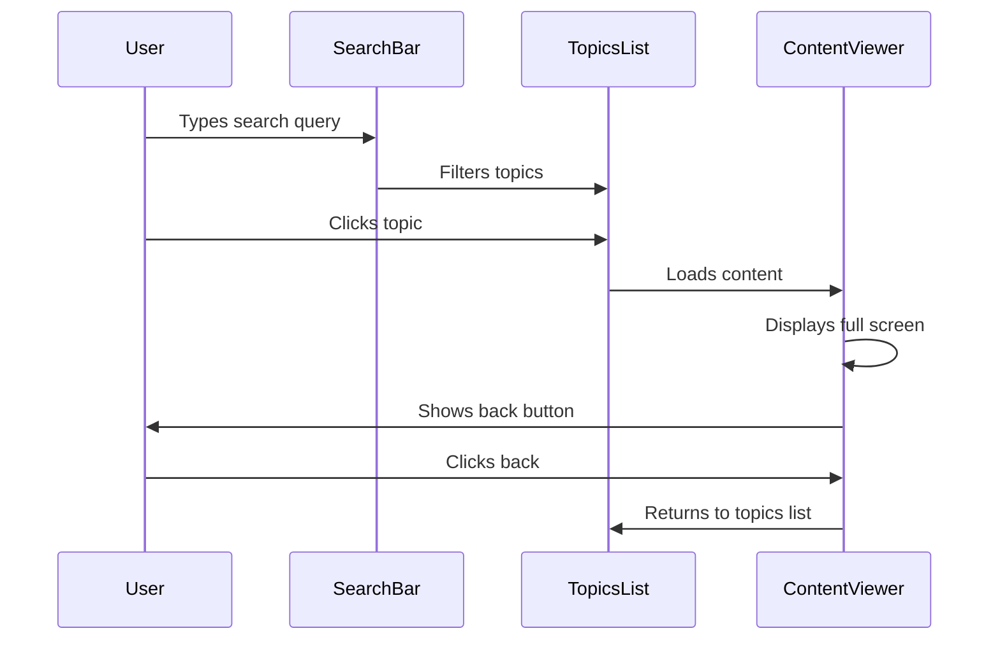
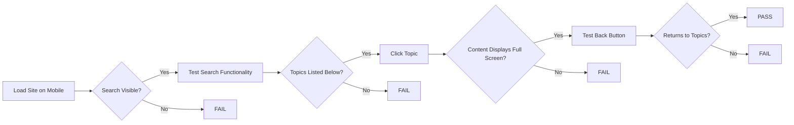

# Mobile Layout Cleanup Design

## Overview

This design addresses the simplification of the mobile layout for the Active Directory Tech Blog by removing the welcome message, streamlining navigation, and ensuring seamless content display when topics are clicked. The goal is to create a clean, focused mobile experience that prioritizes content accessibility and search functionality.

## Technology Stack & Dependencies

- **Frontend Framework**: Bootstrap 5.3.0 with custom CSS Grid
- **Content Rendering**: Marked.js for Markdown parsing
- **State Management**: Vanilla JavaScript with ResponsiveLayoutManager class
- **Responsive Design**: CSS Grid with mobile-first approach
- **Navigation**: Bootstrap Offcanvas for mobile sidebar

## Current Mobile Layout Issues

### Problem Analysis



**Current Pain Points:**
1. **Welcome Screen Obstruction**: Large welcome message takes up valuable mobile screen space
2. **Extra Navigation Step**: Users must click "Browse Topics" button to access search and topics
3. **Hamburger Icon Confusion**: Mobile header hamburger icon duplicates functionality
4. **Content Discovery Friction**: Search and topics are hidden behind the welcome screen

## Proposed Mobile Architecture

### Simplified Mobile Layout



### Component Hierarchy Redesign



## Layout Structure Changes

### HTML Structure Modifications

#### Remove Mobile Header
```html
<!-- DELETE: Mobile header with hamburger menu -->
<!-- <header class="mobile-header d-lg-none fixed-top">...</header> -->
```

#### Remove Welcome Content for Mobile
```html
<!-- MODIFY: Hide welcome content on mobile -->
<main class="main-content d-lg-none" id="mobileContent">
  <article id="postContent" class="content-wrapper">
    <!-- Welcome content will be completely hidden on mobile -->
  </article>
</main>
```

#### Direct Sidebar Access on Mobile
```html
<!-- MODIFY: Make sidebar always visible on mobile initially -->
<nav class="sidebar-nav mobile-sidebar-always-visible" id="sidebarOffcanvas">
  <!-- Search and topics directly accessible -->
</nav>
```

### CSS Layout Updates

#### Mobile-First Search and Topics Layout
```css
/* Mobile layout - search and topics always visible */
@media (max-width: 991.98px) {
  .sidebar-nav {
    position: static;
    transform: none;
    width: 100%;
    height: auto;
    box-shadow: none;
    border: none;
  }
  
  .mobile-header {
    display: none; /* Remove mobile header completely */
  }
  
  .welcome-content {
    display: none; /* Hide welcome message on mobile */
  }
  
  .main-content {
    padding-top: 0; /* Remove mobile header spacing */
  }
}
```

#### Content Display Optimization
```css
/* Mobile content display when topic is selected */
.mobile-content-view {
  position: fixed;
  top: 0;
  left: 0;
  width: 100%;
  height: 100vh;
  background: white;
  z-index: 1050;
  overflow-y: auto;
  padding: var(--spacing-md);
}

.mobile-content-header {
  display: flex;
  align-items: center;
  padding: var(--spacing-sm) 0;
  border-bottom: 1px solid var(--gray-200);
  margin-bottom: var(--spacing-md);
}

.mobile-back-button {
  margin-right: var(--spacing-sm);
  padding: var(--spacing-xs) var(--spacing-sm);
  background: var(--primary-color);
  color: white;
  border: none;
  border-radius: var(--border-radius);
}
```

## Content Rendering Enhancement

### Mobile Content Display Flow



### JavaScript Content Loading Updates

#### Mobile Content Display Manager
```javascript
class MobileContentManager {
  constructor() {
    this.isContentView = false;
    this.currentContent = null;
  }
  
  showContent(postPath, postTitle) {
    // Create full-screen content view
    this.createContentOverlay();
    this.loadPostContent(postPath, postTitle);
    this.isContentView = true;
  }
  
  hideContent() {
    // Return to topics list
    this.removeContentOverlay();
    this.isContentView = false;
  }
  
  createContentOverlay() {
    const overlay = document.createElement('div');
    overlay.className = 'mobile-content-view';
    overlay.innerHTML = `
      <div class="mobile-content-header">
        <button class="mobile-back-button" onclick="mobileContentManager.hideContent()">
          ← Back
        </button>
        <h6 class="mb-0 text-truncate">Article</h6>
      </div>
      <div class="mobile-content-body" id="mobileContentBody"></div>
    `;
    document.body.appendChild(overlay);
  }
}
```

## Search Functionality Enhancement

### Persistent Search on Mobile

#### Search Container Always Visible
```css
.search-container {
  position: sticky;
  top: 0;
  background: white;
  z-index: 10;
  box-shadow: 0 2px 4px rgba(0,0,0,0.1);
  padding: var(--spacing-md);
}

@media (max-width: 991.98px) {
  .search-container {
    margin: 0;
    border-radius: 0;
  }
}
```

#### Enhanced Search UX
```javascript
// Enhanced search with mobile optimization
function initMobileSearch() {
  const searchInput = document.getElementById('searchInput');
  
  searchInput.addEventListener('input', debounce((e) => {
    const query = e.target.value.trim();
    filterTopicsForMobile(query);
  }, 300));
}

function filterTopicsForMobile(query) {
  const topics = document.querySelectorAll('.topic-card');
  
  topics.forEach(topic => {
    const title = topic.dataset.title.toLowerCase();
    const matches = title.includes(query.toLowerCase());
    topic.style.display = matches ? 'block' : 'none';
  });
}
```

## Responsive Breakpoint Management

### Updated Breakpoint Behavior

```css
/* Mobile-first approach - no breakpoint needed for mobile */
.layout-container {
  display: block; /* Simple block layout on mobile */
}

/* Tablet and above - maintain existing behavior */
@media (min-width: 768px) {
  .layout-container {
    /* Tablet specific adjustments */
  }
}

/* Desktop - full grid layout */
@media (min-width: 992px) {
  .layout-container {
    display: grid;
    grid-template-columns: 350px 1fr 280px;
    grid-template-areas: "sidebar content toc";
  }
}
```

### JavaScript Responsive Logic Updates

```javascript
// Simplified mobile detection and handling
function updateMobileLayout() {
  const isMobile = window.innerWidth < 992;
  
  if (isMobile) {
    // Enable simplified mobile layout
    document.body.classList.add('mobile-layout');
    // Remove any desktop-specific elements
    removeMobileHeader();
    showDirectTopicAccess();
  } else {
    // Standard desktop layout
    document.body.classList.remove('mobile-layout');
    restoreDesktopLayout();
  }
}
```

## Implementation Strategy

### Phase 1: Remove Obstructions
1. Hide mobile header (`mobile-header` element)
2. Hide welcome content on mobile (`welcome-content` with mobile-specific CSS)
3. Remove hamburger menu functionality for mobile

### Phase 2: Direct Topic Access
1. Make sidebar content (search + topics) directly visible on mobile
2. Remove offcanvas behavior for mobile
3. Style search and topics for mobile-first approach

### Phase 3: Content Display Enhancement
1. Implement full-screen content overlay for mobile
2. Add back navigation button
3. Ensure proper content rendering and scrolling

### Phase 4: Search Optimization
1. Make search bar sticky at top on mobile
2. Enhance search filtering for mobile UX
3. Optimize touch interactions

## Testing Strategy

### Mobile Testing Scenarios


### Device Testing Matrix
| Device Category | Screen Size | Key Test Points |
|----------------|-------------|-----------------|
| Mobile Portrait | 375px-414px | Search accessibility, topic tapping, content readability |
| Mobile Landscape | 667px-896px | Layout stability, content display |
| Small Tablet | 768px-1024px | Transition between mobile/desktop modes |

### Performance Validation
- **Load Time**: Search and topics visible within 1 second
- **Interaction Response**: Topic selection to content display < 300ms
- **Memory Usage**: No memory leaks in content overlay creation/destruction
- **Touch Responsiveness**: All interactive elements meet 44px minimum touch target

This design ensures a streamlined, efficient mobile experience that prioritizes content discovery and accessibility while maintaining the desktop functionality intact.