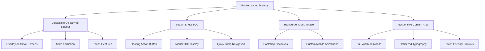
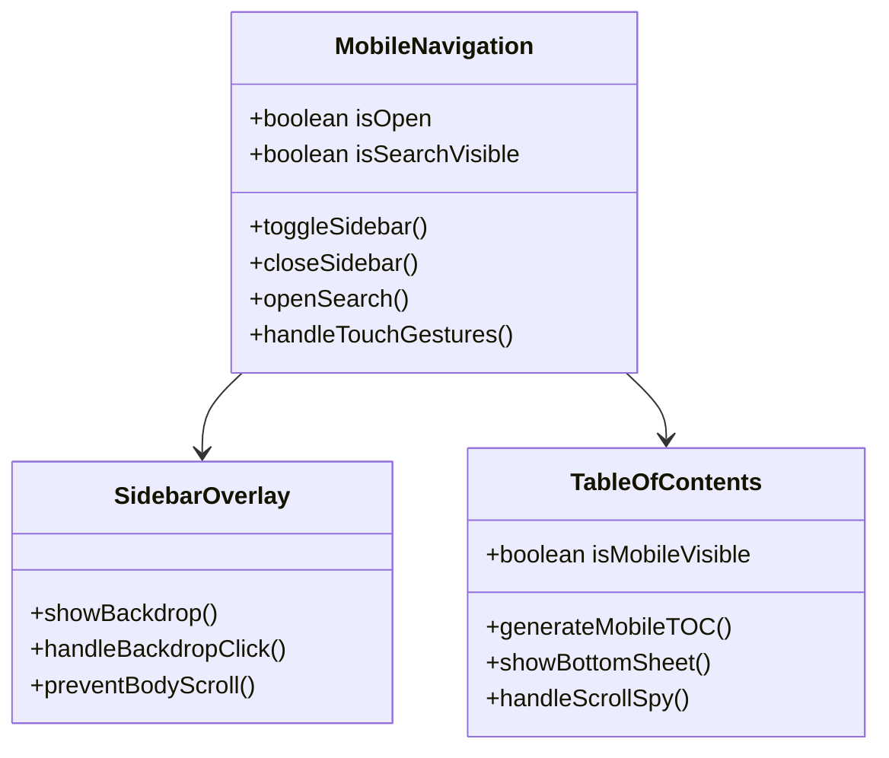

# Mobile Layout Fix Design Document

## Overview

The fuzzy-invention technical blog currently experiences significant usability issues on mobile devices despite working properly on desktop. This design document outlines the necessary improvements to create a responsive, mobile-first experience while maintaining the existing desktop functionality.

### Current Issues Identified
- **Sidebar Navigation**: Fixed sidebar with `col-md-2` is hidden on mobile but not replaced with mobile navigation
- **Layout Constraints**: Three-column layout (sidebar, main, TOC) doesn't adapt to small screens
- **Table of Contents**: Right TOC panel is hidden on mobile without alternative access
- **Fixed Height Panels**: `height: 100vh` on sidebar/TOC causes layout issues on mobile
- **Quiz Pages**: Missing responsive design in quiz interface
- **Touch Interactions**: No touch-optimized controls for mobile users

## Architecture

### Current Desktop Layout Structure
```
┌─────────────────────────────────────────────────────┐
│  Container-fluid                                    │
│  ┌─────────┬─────────────────────┬─────────────────┐ │
│  │Sidebar  │   Main Content      │   TOC Panel     │ │
│  │(col-md-2│   (col-md-8)        │   (col-md-2)    │ │
│  │         │                     │   d-none        │ │
│  │Fixed    │                     │   d-md-block    │ │
│  │100vh    │                     │                 │ │
│  └─────────┴─────────────────────┴─────────────────┘ │
└─────────────────────────────────────────────────────┘
```

### Proposed Mobile-First Layout


## Component Architecture

### Mobile Navigation Component


### Responsive Breakpoint Strategy

| Breakpoint | Layout Behavior | Navigation | TOC |
|------------|----------------|------------|-----|
| `xs` (< 576px) | Single column, full-width content | Hamburger + Offcanvas | Floating TOC button |
| `sm` (576-768px) | Single column, full-width content | Hamburger + Offcanvas | Floating TOC button |
| `md` (768-992px) | Two column (sidebar + content) | Visible sidebar | Hidden TOC or overlay |
| `lg` (992px+) | Three column (sidebar + content + TOC) | Visible sidebar | Visible TOC panel |

## Implementation Strategy

### 1. HTML Structure Modifications

#### Mobile Navigation Header
```html
<!-- Mobile-only header with hamburger menu -->
<header class="mobile-header d-md-none fixed-top">
  <div class="d-flex justify-content-between align-items-center p-3">
    <button class="btn btn-outline-secondary" id="mobileMenuToggle">
      <i class="bi bi-list"></i>
    </button>
    <h5 class="mb-0">My Tech Blog</h5>
    <button class="btn btn-outline-secondary" id="mobileTOCToggle">
      <i class="bi bi-bookmark"></i>
    </button>
  </div>
</header>
```

#### Enhanced Sidebar with Bootstrap Offcanvas
```html
<!-- Updated sidebar with offcanvas support -->
<div class="offcanvas-md offcanvas-start" id="sidebarOffcanvas">
  <div class="offcanvas-header d-md-none">
    <h5 class="offcanvas-title">Topics</h5>
    <button class="btn-close" data-bs-dismiss="offcanvas"></button>
  </div>
  <div class="offcanvas-body">
    <!-- Existing sidebar content -->
  </div>
</div>
```

### 2. CSS Responsive Enhancements

#### Mobile-First Media Queries
```css
/* Base mobile styles */
.mobile-header {
  background: var(--bg);
  border-bottom: 1px solid var(--border);
  backdrop-filter: blur(8px);
  z-index: 1030;
}

/* Responsive content padding */
.main-content {
  padding-top: 0;
}

@media (max-width: 767.98px) {
  .main-content {
    padding-top: 70px; /* Account for mobile header */
    padding-left: 15px;
    padding-right: 15px;
  }
  
  .sidebar-offcanvas {
    width: 300px;
  }
}

/* TOC Mobile Styles */
.mobile-toc-fab {
  position: fixed;
  bottom: 20px;
  right: 20px;
  z-index: 1025;
  border-radius: 50%;
  width: 56px;
  height: 56px;
}

.mobile-toc-modal .modal-body {
  max-height: 70vh;
  overflow-y: auto;
}
```

### 3. JavaScript Mobile Interactions

#### Touch Gesture Support
```javascript
// Mobile-specific functionality
class MobileLayoutManager {
  constructor() {
    this.initMobileNavigation();
    this.initTOCHandling();
    this.initTouchGestures();
  }
  
  initMobileNavigation() {
    const menuToggle = document.getElementById('mobileMenuToggle');
    const sidebar = new bootstrap.Offcanvas('#sidebarOffcanvas');
    
    menuToggle?.addEventListener('click', () => {
      sidebar.toggle();
    });
  }
  
  initTOCHandling() {
    if (window.innerWidth < 768) {
      this.createMobileTOC();
    }
  }
  
  initTouchGestures() {
    // Swipe gesture to open sidebar
    let touchStartX = 0;
    document.addEventListener('touchstart', (e) => {
      touchStartX = e.touches[0].clientX;
    });
    
    document.addEventListener('touchend', (e) => {
      const touchEndX = e.changedTouches[0].clientX;
      if (touchStartX < 50 && touchEndX > touchStartX + 100) {
        // Swipe right from left edge
        const sidebar = bootstrap.Offcanvas.getInstance('#sidebarOffcanvas');
        sidebar?.show();
      }
    });
  }
}
```

## Quiz Page Mobile Optimization

### Fixed Header Issues
The quiz page has a fixed top bar that needs mobile optimization:

```css
/* Quiz mobile responsive fixes */
@media (max-width: 767.98px) {
  .topbar .wrap {
    padding: 8px 12px;
  }
  
  .topbar .title {
    flex-direction: column;
    gap: 8px;
    align-items: stretch;
  }
  
  .topbar h1 {
    font-size: 18px;
    text-align: center;
  }
  
  .topbar .badge,
  .topbar .pill {
    font-size: 12px;
    padding: 4px 8px;
  }
  
  .topbar .btn {
    padding: 8px 12px;
    font-size: 14px;
  }
  
  /* Adjust main content top padding */
  main {
    padding-top: 140px; /* Increased for mobile header */
  }
}
```

### Mobile Quiz Card Layout
```css
@media (max-width: 767.98px) {
  .card {
    margin: 8px;
    padding: 12px;
  }
  
  .qhead {
    flex-direction: column;
    gap: 8px;
  }
  
  .qnum {
    align-self: flex-start;
  }
  
  .options {
    gap: 6px;
  }
  
  .opt {
    padding: 8px;
    font-size: 14px;
  }
}
```

## Performance Considerations

### Mobile-Specific Optimizations
1. **Lazy Loading**: Implement intersection observer for quiz questions
2. **Touch Optimization**: Increase touch targets to minimum 44px
3. **Reduced Motion**: Respect `prefers-reduced-motion` media query
4. **Viewport Units**: Avoid `100vh` due to mobile browser inconsistencies

### Loading Performance
```javascript
// Conditional loading for mobile features
if (window.innerWidth < 768) {
  import('./mobile-enhancements.js');
}

// Intersection Observer for lazy loading
const observerOptions = {
  rootMargin: '50px 0px',
  threshold: 0.1
};
```

## Testing Strategy

### Mobile Testing Matrix
| Device Category | Screen Sizes | Test Scenarios |
|----------------|--------------|----------------|
| Small Mobile | 320px - 480px | Navigation, Reading, Quiz interaction |
| Large Mobile | 481px - 767px | Layout transitions, Touch gestures |
| Tablet Portrait | 768px - 1024px | Hybrid layout behavior |
| Tablet Landscape | 1024px+ | Desktop-like experience |

### Key Test Cases
1. **Navigation Flow**
   - Hamburger menu opens/closes smoothly
   - Search functionality works in mobile
   - TOC accessibility from mobile FAB

2. **Content Consumption**
   - Text readability without horizontal scroll
   - Code blocks responsive formatting
   - Image scaling and viewport fit

3. **Quiz Interaction**
   - Touch targets adequate size (44px+)
   - Fixed headers don't overlap content
   - Progress tracking visible on mobile

4. **Performance**
   - Page load under 3 seconds on 3G
   - Smooth animations (60fps)
   - No layout shifts during loading

## Migration Strategy

### Phase 1: Core Mobile Navigation (Week 1)
- Implement Bootstrap offcanvas sidebar
- Add mobile header with hamburger menu
- Update CSS for responsive breakpoints

### Phase 2: Content Optimization (Week 1-2)
- Fix main content area responsiveness
- Implement mobile TOC solution
- Optimize typography for mobile reading

### Phase 3: Quiz Enhancement (Week 2)
- Responsive quiz layout
- Touch-optimized interactions
- Mobile-specific animations

### Phase 4: Polish & Performance (Week 2-3)
- Gesture support implementation
- Performance optimization
- Cross-device testing and refinement