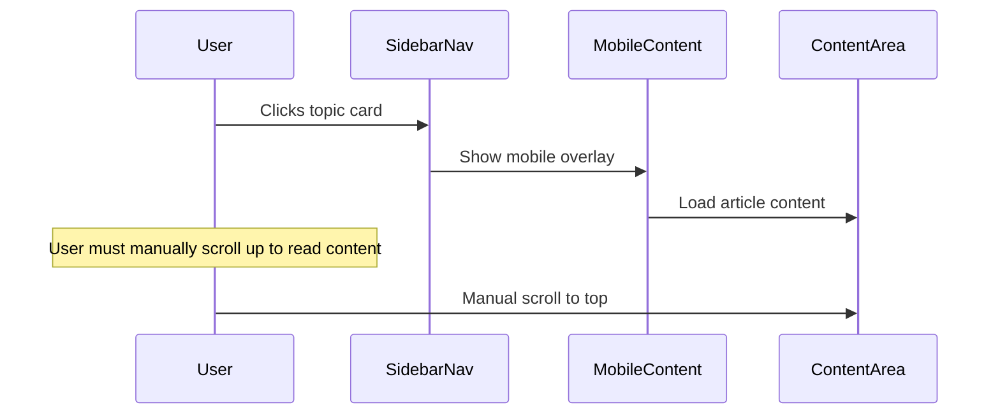
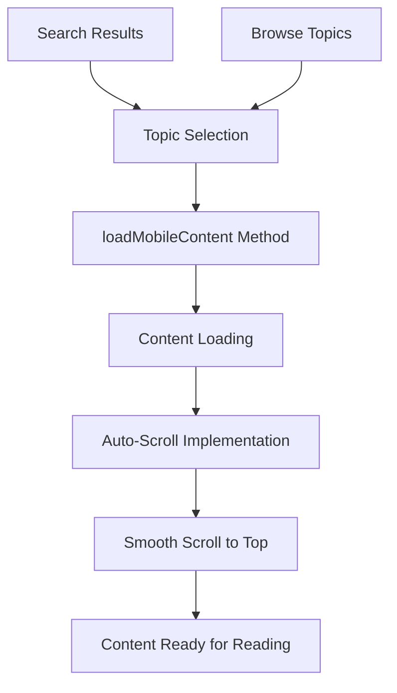
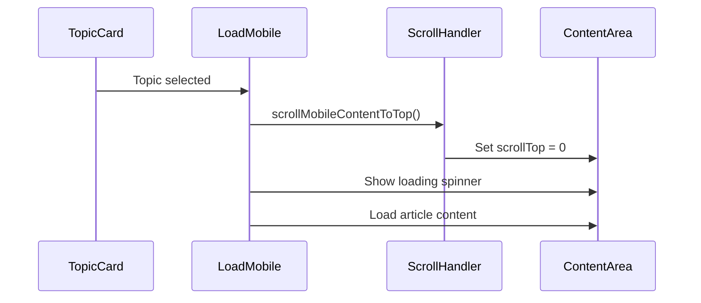
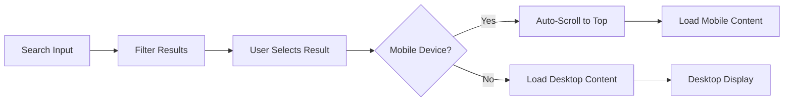

# Mobile Topic Auto-Scroll Feature Design

## Overview

This design document outlines the implementation of automatic scroll-to-top functionality for mobile devices in the fuzzy-invention blog platform. When users select a topic (either through search or browsing), the interface will automatically scroll to the top of the content area, providing immediate access to the article content without requiring manual scrolling.

## Current Mobile Behavior Analysis

### Existing Mobile Navigation Flow


### Problem Statement
- Users select topics in mobile view but content starts at previous scroll position
- Manual scrolling required to reach article beginning
- Suboptimal reading experience, especially on longer topic lists
- Interrupts reading flow and creates friction

## Technical Architecture

### Component Integration


### Mobile Content Area Components
- **Mobile Content Overlay**: Fixed-position container (`#mobileContent`)
- **Content Header**: Sticky header with back navigation
- **Article Container**: Scrollable content area (`#mobilePostContent`)
- **Topics Section**: Related topics after article content

## Implementation Strategy

### Auto-Scroll Trigger Points

#### 1. Topic Card Selection
```javascript
// In loadMobileContent method enhancement
loadMobileContent(path, title) {
    
    // Auto-scroll to top immediately when mobile content is shown
    this.scrollMobileContentToTop();
    
    // Show mobile content area
    mobileContentArea.style.display = 'flex';
    
    // ... rest of existing code ...
}
```

#### 2. Search Result Selection
```javascript
// Enhanced search functionality with auto-scroll
handleSearchResultSelection(result) {
    // ... existing selection logic ...
    
    if (currentBreakpoint === 'mobile') {
        this.scrollMobileContentToTop();
    }
    
    this.loadPost(result.path, result.title);
}
```

### Scroll Implementation Methods

#### Primary Method: Mobile Content Area Scroll
```javascript
scrollMobileContentToTop() {
    const mobileContentArea = document.getElementById('mobileContent');
    
    if (mobileContentArea) {
        // Immediate scroll for responsive feedback
        mobileContentArea.scrollTop = 0;
        
        // Also ensure window is at top (fallback)
        window.scrollTo({
            top: 0,
            behavior: 'instant'
        });
    }
}
```

#### Enhanced Smooth Scroll with Timing Control
```javascript
scrollMobileContentToTopSmooth(delay = 0) {
    setTimeout(() => {
        const mobileContentArea = document.getElementById('mobileContent');
        
        if (mobileContentArea) {
            mobileContentArea.scrollTo({
                top: 0,
                behavior: 'smooth'
            });
        }
        
        // Ensure window is also at top
        window.scrollTo({
            top: 0,
            behavior: 'smooth'
        });
    }, delay);
}
```

### Integration Points

#### 1. Content Loading Integration


#### 2. Search Integration


## User Experience Enhancements

### Scroll Behavior Options

#### Option 1: Instant Scroll (Recommended)
- **Behavior**: Immediate scroll to top when topic selected
- **Advantage**: Fastest response, immediate content access
- **Implementation**: `scrollTop = 0` with `behavior: 'instant'`

#### Option 2: Smooth Scroll
- **Behavior**: Animated scroll to top
- **Advantage**: Visual continuity, polished feel
- **Consideration**: Slight delay before content is accessible

#### Option 3: Hybrid Approach
- **Instant scroll** for topic selection
- **Smooth scroll** for internal navigation (TOC, back buttons)

### Visual Feedback Integration

#### Loading State Enhancement
```javascript
// Enhanced loading with scroll position reset
showMobileLoadingState() {
    const mobilePostContent = document.getElementById('mobilePostContent');
    
    // Scroll to top first
    this.scrollMobileContentToTop();
    
    // Then show loading state
    mobilePostContent.innerHTML = `
        <div class="text-center py-5">
            <div class="spinner-border text-primary" role="status">
                <span class="visually-hidden">Loading...</span>
            </div>
            <p class="mt-3 text-muted">Loading article...</p>
        </div>
    `;
}
```

## Testing Strategy

### User Experience Testing

#### Test Case 1: Topic Selection from List
1. Navigate to mobile view
2. Scroll down in topic list
3. Select any topic
4. **Expected**: Content area automatically scrolls to top
5. **Verify**: Article title is immediately visible

#### Test Case 2: Search Result Selection
1. Open search in mobile view
2. Search for topic
3. Select search result
4. **Expected**: Auto-scroll to top occurs
5. **Verify**: Smooth transition to reading mode

#### Test Case 3: Related Topics Navigation
1. Read article in mobile view
2. Scroll to bottom related topics
3. Select related topic
4. **Expected**: New article loads at top
5. **Verify**: No manual scrolling required

### Technical Testing

#### Performance Validation
```javascript
// Performance monitoring for scroll operations
function measureScrollPerformance() {
    const startTime = performance.now();
    
    scrollMobileContentToTop();
    
    requestAnimationFrame(() => {
        const endTime = performance.now();
        console.log(`Mobile scroll operation: ${endTime - startTime}ms`);
    });
}
```

#### Cross-Device Compatibility
- **iPhone Safari**: Touch scroll behavior
- **Android Chrome**: Native scroll handling  
- **iPad**: Tablet breakpoint behavior
- **Small screens**: Content visibility validation

## Implementation Timeline

### Phase 1: Core Auto-Scroll (1-2 hours)
- Implement `scrollMobileContentToTop()` method
- Integrate with `loadMobileContent()` function
- Basic testing on primary mobile devices

### Phase 2: Search Integration (30 minutes)
- Add auto-scroll to search result selection
- Test search → content flow

### Phase 3: Enhancement & Polish (30 minutes)
- Fine-tune scroll timing
- Add performance monitoring
- Cross-device testing validation

## Accessibility Considerations

### Screen Reader Support
- Ensure focus management after scroll
- Announce content changes appropriately
- Maintain tab order consistency

### Motor Accessibility
- Instant scroll reduces navigation burden
- Eliminates need for precise scroll gestures
- Improves one-handed usage experience

### Visual Accessibility
- Maintains visual hierarchy after scroll
- Preserves content contrast and sizing
- Supports high contrast mode compatibility

## Performance Impact

### Minimal Performance Footprint
- **Scroll Operation**: ~1-2ms execution time
- **Memory Usage**: No additional memory allocation
- **Battery Impact**: Negligible - single DOM operation

### Optimization Strategies
- Use `scrollTop = 0` instead of `scrollTo()` for instant response
- Avoid unnecessary animation when immediate access is preferred
- Leverage browser-native scroll optimizations

## Success Metrics

### User Experience Indicators
- **Reduced bounce rate** on mobile article pages
- **Increased reading time** per article
- **Improved mobile navigation flow** user feedback

### Technical Metrics
- **Scroll operation latency** < 5ms
- **Zero layout thrashing** during scroll operations
- **Consistent behavior** across mobile devices and browsers

This design ensures that mobile users can seamlessly transition from topic selection to content consumption without the friction of manual scrolling, significantly improving the overall reading experience on the fuzzy-invention platform.