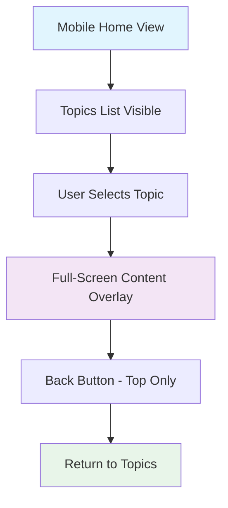
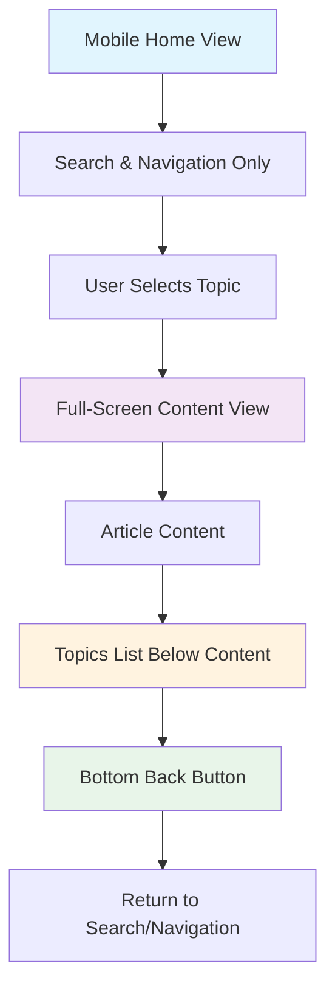

# Mobile Topic Layout Enhancement Design

## Overview

This design addresses improvements to the mobile reading experience by repositioning the topics list and enhancing navigation flow. The current mobile layout shows content in a full-screen overlay, but the topics list appears at the bottom before content is loaded. This design relocates the topics list to appear after the article content and adds a bottom back button for improved user experience.

## Current Mobile Layout Analysis

### Existing Structure


### Current Issues
- Topics list is visible at bottom of home screen before content selection
- Only top back button available after reading
- No easy navigation back to topics after finishing an article
- User must scroll back to top to access back button

## Enhanced Mobile Layout Design

### Improved User Flow


### Layout Components

#### 1. Mobile Home View Simplification
- **Search Section**: Prominent at top with professional header
- **Navigation Only**: Clean topic browsing without showing full list
- **No Bottom Topics**: Remove topics list from initial view for cleaner interface

#### 2. Content View Structure
```
┌─────────────────────────┐
│ [←] Back | Article Title│  ← Top Navigation Bar
├─────────────────────────┤
│                         │
│    Article Content      │  ← Main Content Area
│    (Scrollable)         │
│                         │
├─────────────────────────┤
│    Related Topics       │  ← Topics List Section
│    • Topic 1            │
│    • Topic 2            │
│    • Topic 3            │
├─────────────────────────┤
│      [← Back]           │  ← Bottom Back Button
└─────────────────────────┘
```

#### 3. Topics List Positioning
- **Location**: Positioned after article content ends
- **Content**: Show related or all available topics
- **Styling**: Consistent with main navigation design
- **Behavior**: Allow direct topic switching without returning to home

#### 4. Bottom Back Button
- **Position**: Fixed at bottom of content area
- **Functionality**: Same as top back button - returns to navigation view
- **Design**: Prominent, finger-friendly touch target
- **Context**: Available after user finishes reading

## Implementation Requirements

### HTML Structure Changes

#### Mobile Content Area Enhancement
```html
<main class="mobile-content-area d-lg-none" id="mobileContent">
  <!-- Existing top navigation -->
  <div class="mobile-content-header">
    <button class="mobile-back-button" id="mobileBackButton">
      <i class="bi bi-arrow-left"></i> Back
    </button>
    <h6 class="mobile-content-title" id="mobileContentTitle">Article</h6>
  </div>
  
  <!-- Article content -->
  <article id="mobilePostContent" class="mobile-content-wrapper"></article>
  
  <!-- New: Topics list section -->
  <section class="mobile-topics-section" id="mobileTopicsSection">
    <div class="topics-section-header">
      <h6 class="text-primary fw-bold">📚 Browse More Topics</h6>
    </div>
    <div class="topics-list-container">
      <ul class="mobile-topics-list" id="mobileTopicsList"></ul>
    </div>
  </section>
  
  <!-- New: Bottom back button -->
  <div class="mobile-bottom-navigation">
    <button class="mobile-bottom-back-button" id="mobileBottomBackButton">
      <i class="bi bi-arrow-left"></i> Back to Topics
    </button>
  </div>
</main>
```

### CSS Styling Requirements

#### Mobile Content Area Styling
```css
.mobile-content-area {
  display: none;
  flex-direction: column;
  height: 100vh;
  background: white;
  z-index: 1000;
}

.mobile-content-wrapper {
  flex: 1;
  overflow-y: auto;
  padding: 1rem;
}

.mobile-topics-section {
  background: #f8f9fa;
  border-top: 1px solid #dee2e6;
  padding: 1rem;
}

.topics-section-header {
  margin-bottom: 0.75rem;
}

.mobile-topics-list {
  list-style: none;
  padding: 0;
  margin: 0;
}

.mobile-topics-list .topic-card {
  padding: 0.75rem;
  margin-bottom: 0.5rem;
  background: white;
  border: 1px solid #dee2e6;
  border-radius: 6px;
  cursor: pointer;
  transition: all 0.2s ease;
}

.mobile-topics-list .topic-card:hover {
  background: #e3f2fd;
  border-color: #1976d2;
}

.mobile-bottom-navigation {
  padding: 1rem;
  background: white;
  border-top: 1px solid #dee2e6;
  position: sticky;
  bottom: 0;
}

.mobile-bottom-back-button {
  width: 100%;
  padding: 0.75rem;
  background: #1976d2;
  color: white;
  border: none;
  border-radius: 6px;
  font-size: 1rem;
  font-weight: 500;
  cursor: pointer;
  transition: background-color 0.2s ease;
}

.mobile-bottom-back-button:hover {
  background: #1565c0;
}
```

### JavaScript Functionality Updates

#### Enhanced Mobile Content Loading
```javascript
loadMobileContent(path, title) {
  const mobileContentArea = document.getElementById('mobileContent');
  const mobilePostContent = document.getElementById('mobilePostContent');
  const mobileTopicsSection = document.getElementById('mobileTopicsSection');
  const mobileTopicsList = document.getElementById('mobileTopicsList');
  const mobileBottomBackButton = document.getElementById('mobileBottomBackButton');
  
  // Show mobile content area
  mobileContentArea.style.display = 'flex';
  
  // Setup back button functionality (both top and bottom)
  const backToTopics = () => {
    mobileContentArea.style.display = 'none';
    window.scrollTo(0, 0);
  };
  
  // Bind both back buttons
  document.getElementById('mobileBackButton').onclick = backToTopics;
  mobileBottomBackButton.onclick = backToTopics;
  
  // Load article content
  this.fetchAndRenderContent(path, title, mobilePostContent);
  
  // Populate topics list
  this.populateMobileTopicsList(mobileTopicsList, path);
}

populateMobileTopicsList(container, currentPath) {
  container.innerHTML = '';
  
  // Get all posts except current one
  const otherPosts = allPosts.filter(post => post.path !== currentPath);
  
  // Show up to 10 related topics
  const postsToShow = otherPosts.slice(0, 10);
  
  postsToShow.forEach(post => {
    const li = document.createElement('li');
    const card = document.createElement('div');
    card.className = 'topic-card';
    card.dataset.path = post.path;
    card.dataset.title = post.title;
    card.innerHTML = `
      <div class="topic-title">${post.title}</div>
      <div class="topic-meta text-muted small">${post.category || 'General'}</div>
    `;
    
    // Handle topic selection
    card.onclick = () => {
      this.loadMobileContent(post.path, post.title);
    };
    
    li.appendChild(card);
    container.appendChild(li);
  });
}
```

## User Experience Enhancements

### Navigation Flow Improvements
1. **Cleaner Home View**: Remove topics list from initial mobile view
2. **Content-First Reading**: Focus on article content without distractions
3. **Post-Reading Discovery**: Show topics after content for natural flow
4. **Easy Return Navigation**: Bottom back button eliminates scrolling to top
5. **Topic Switching**: Direct navigation between topics without returning home

### Accessibility Considerations
- **Touch Targets**: All buttons meet minimum 44px touch target size
- **Contrast**: Maintain WCAG AA contrast ratios for all text and buttons
- **Focus Management**: Proper focus handling when switching between topics
- **Screen Reader Support**: Appropriate ARIA labels and semantic structure

### Performance Optimizations
- **Lazy Loading**: Load topics list only when content is displayed
- **Efficient Rendering**: Reuse existing topic rendering functions
- **Memory Management**: Clean up event listeners when switching content

## Testing Strategy

### Device Testing
- **iPhone SE (Small Screen)**: Verify layout on smallest modern mobile screens
- **Standard Mobile (375px)**: Test on common mobile viewport sizes
- **Large Mobile (414px+)**: Ensure proper scaling on larger mobile devices

### Interaction Testing
- **Touch Navigation**: Verify all buttons respond properly to touch
- **Scroll Behavior**: Test smooth scrolling and content positioning
- **Back Button Functionality**: Confirm both top and bottom buttons work
- **Topic Switching**: Validate direct topic-to-topic navigation

### Content Testing
- **Long Articles**: Test with articles of varying lengths
- **Short Articles**: Ensure topics list appears appropriately
- **No Topics Scenario**: Handle edge cases gracefully