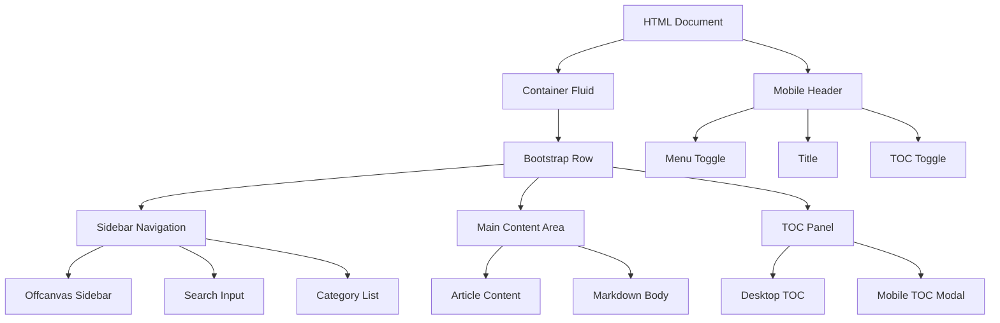
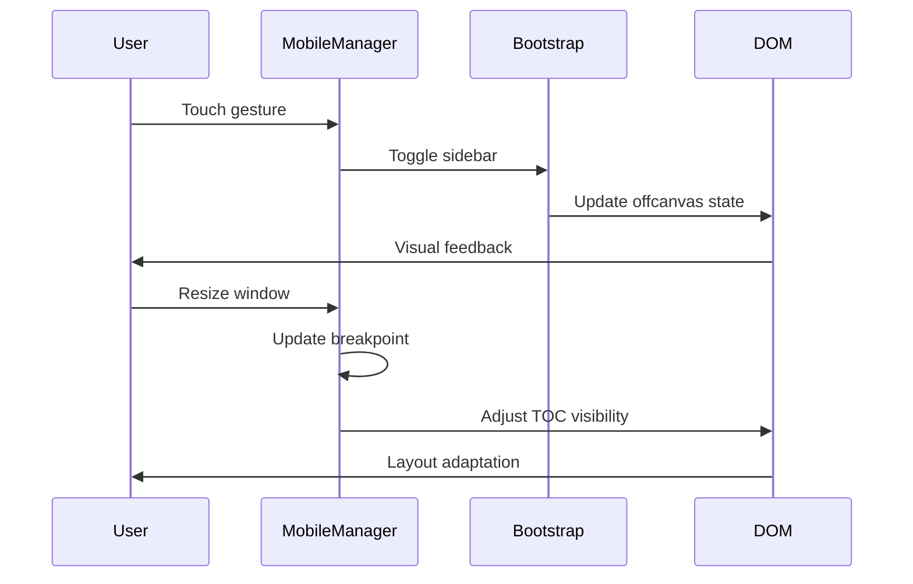

# Responsive Layout Fix Design

## Overview

This document outlines the design solution to fix responsive layout issues affecting both desktop and mobile views of the fuzzy-invention technical blog. The current layout implementation has become messy across different screen sizes, causing poor user experience and content accessibility problems.

### Problem Statement

The current responsive layout suffers from several issues:
- Inconsistent spacing and padding across breakpoints
- Poor mobile navigation experience
- Content overflow and text readability problems
- Sidebar and TOC positioning conflicts
- Inadequate touch targets on mobile devices
- Bootstrap grid system conflicts with custom CSS

## Technology Stack & Dependencies

- **Frontend Framework**: Bootstrap 5.3.0
- **CSS**: Custom responsive CSS with mobile-first approach
- **JavaScript**: Vanilla JS with Bootstrap components
- **Icons**: Bootstrap Icons 1.11.0
- **Content Rendering**: Marked.js for markdown parsing

## Component Architecture

### Layout Structure Hierarchy



### Component Definitions

#### MobileLayoutManager Class
- **Purpose**: Manages responsive behavior and mobile-specific interactions
- **Responsibilities**:
  - Touch gesture handling for sidebar navigation
  - Auto-close sidebar on mobile link clicks
  - TOC visibility management based on screen size
  - Resize event handling for breakpoint changes

#### Responsive Navigation System
- **Desktop**: Fixed sidebar with sticky positioning
- **Tablet**: Collapsible sidebar without TOC panel
- **Mobile**: Offcanvas sidebar with floating TOC button

#### Content Rendering Pipeline
- **Input**: Markdown files from posts directory
- **Processing**: Marked.js parsing with custom header ID generation
- **Output**: Responsive HTML with scroll-margin adjustments

## Responsive Breakpoint Strategy

### Breakpoint Definitions
```css
Mobile: max-width: 767.98px
Tablet: 768px - 991.98px  
Desktop: min-width: 992px
```

### Layout Adaptations by Breakpoint

#### Mobile Layout (≤767px)
- Fixed header with blur backdrop
- Offcanvas sidebar navigation
- Main content with 80px top padding
- Floating TOC action button
- Touch-optimized navigation targets (minimum 44px)
- Reduced font sizes for better readability

#### Tablet Layout (768px-991px)
- Collapsed sidebar that can be toggled
- Main content takes full width minus sidebar
- TOC panel hidden to save space
- Standard Bootstrap responsive behavior

#### Desktop Layout (≥992px)
- Fixed sidebar with sticky positioning
- Three-column layout (sidebar, content, TOC)
- Full TOC panel visible
- Larger font sizes and spacing

## CSS Architecture Improvements

### Mobile-First CSS Structure
```css
/* Base mobile styles */
.component { }

/* Tablet overrides */
@media (min-width: 768px) { }

/* Desktop enhancements */
@media (min-width: 992px) { }
```

### Critical CSS Fixes

#### Sidebar Positioning
- Remove conflicting fixed heights
- Implement proper sticky positioning for desktop
- Use Bootstrap's offcanvas for mobile consistency

#### Content Spacing
- Consistent padding across breakpoints
- Proper scroll margins for anchor navigation
- Responsive typography scaling

#### Touch Target Optimization
- Minimum 44px touch targets for mobile
- Adequate spacing between interactive elements
- Hover state management for touch devices

## State Management Architecture

### Layout State Variables
```javascript
{
  isMobile: boolean,
  sidebarVisible: boolean,
  tocVisible: boolean,
  currentBreakpoint: string,
  touchStartPosition: object
}
```

### Event Handling Flow



## Performance Optimizations

### JavaScript Debouncing
- Search input: 300ms debounce
- Scroll events: 10ms throttling
- Resize events: Immediate with state caching

### CSS Optimizations
- Hardware acceleration for transforms
- Efficient selector specificity
- Minimal reflow/repaint operations

### Content Loading Strategy
- Lazy loading for markdown content
- Efficient DOM manipulation
- Cached category organization

## Accessibility Improvements

### ARIA Labels and Roles
- Proper button labels for screen readers
- Navigation landmarks
- Focus management for modal interactions

### Keyboard Navigation
- Tab order preservation
- Escape key modal closing
- Enter key activation for links

### Screen Reader Support
- Descriptive link text
- Heading hierarchy maintenance
- Skip navigation links

## Browser Compatibility

### Supported Browsers
- Chrome 90+
- Firefox 88+
- Safari 14+
- Edge 90+

### Fallback Strategies
- CSS Grid with Flexbox fallbacks
- Backdrop-filter with solid background fallback
- Touch events with mouse event fallbacks

## Testing Strategy

### Responsive Testing Matrix
| Device Category | Breakpoint | Key Tests |
|----------------|------------|-----------|
| Mobile Phones | 320px-767px | Touch navigation, text readability, button sizes |
| Tablets | 768px-1023px | Sidebar behavior, content flow, orientation changes |
| Desktops | 1024px+ | Three-column layout, hover states, keyboard navigation |

### Cross-Browser Testing
- Layout consistency across browsers
- CSS feature support detection
- JavaScript API compatibility

### Performance Testing
- Load time measurements
- Scroll performance monitoring
- Memory usage tracking

### User Experience Testing
- Navigation flow testing
- Content accessibility validation
- Touch interaction responsiveness    MobileManager->>Bootstrap: Toggle sidebar
    Bootstrap->>DOM: Update offcanvas state
    DOM->>User: Visual feedback
    
    User->>MobileManager: Resize window
    MobileManager->>MobileManager: Update breakpoint
    MobileManager->>DOM: Adjust TOC visibility
    DOM->>User: Layout adaptation
```

## Performance Optimizations

### JavaScript Debouncing
- Search input: 300ms debounce
- Scroll events: 10ms throttling
- Resize events: Immediate with state caching

### CSS Optimizations
- Hardware acceleration for transforms
- Efficient selector specificity
- Minimal reflow/repaint operations

### Content Loading Strategy
- Lazy loading for markdown content
- Efficient DOM manipulation
- Cached category organization

## Accessibility Improvements

### ARIA Labels and Roles
- Proper button labels for screen readers
- Navigation landmarks
- Focus management for modal interactions

### Keyboard Navigation
- Tab order preservation
- Escape key modal closing
- Enter key activation for links

### Screen Reader Support
- Descriptive link text
- Heading hierarchy maintenance
- Skip navigation links

## Browser Compatibility

### Supported Browsers
- Chrome 90+
- Firefox 88+
- Safari 14+
- Edge 90+

### Fallback Strategies
- CSS Grid with Flexbox fallbacks
- Backdrop-filter with solid background fallback
- Touch events with mouse event fallbacks

## Testing Strategy

### Responsive Testing Matrix
| Device Category | Breakpoint | Key Tests |
|----------------|------------|-----------|
| Mobile Phones | 320px-767px | Touch navigation, text readability, button sizes |
| Tablets | 768px-1023px | Sidebar behavior, content flow, orientation changes |
| Desktops | 1024px+ | Three-column layout, hover states, keyboard navigation |

### Cross-Browser Testing
- Layout consistency across browsers
- CSS feature support detection
- JavaScript API compatibility

### Performance Testing
- Load time measurements
- Scroll performance monitoring
- Memory usage tracking

### User Experience Testing
- Navigation flow testing
- Content accessibility validation
- Touch interaction responsiveness


