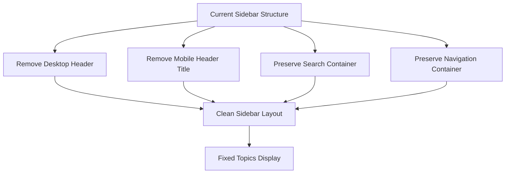

# Sidebar Cleanup Design

## Overview

This design addresses the cleanup of the sidebar navigation by removing the "📚 AD Topics" header section and its associated blue gradient bar, while resolving the issue where topics appear blank under the search box instead of displaying the markdown file topics.

## Current State Analysis

### Identified Issues

1. **Unwanted Visual Elements**
   - Desktop sidebar displays "📚 AD Topics" header with blue gradient background
   - Mobile sidebar shows "📚 Topics" in offcanvas header
   - Blue gradient bar creates visual clutter

2. **Content Display Problem**
   - Topics list appears blank/white under search box
   - Navigation items not rendering from posts.yml data
   - JavaScript renderCategoryList() function may have rendering issues

3. **Redundant UI Elements**
   - Header text duplicates navigation purpose
   - Blue bar doesn't add functional value
   - Mobile and desktop headers inconsistent

## Architecture Changes

### HTML Structure Modifications



### Component Removal Strategy

| Component | Location | Action |
|-----------|----------|---------|
| Desktop Header | `.sidebar-header` div | Remove entire element |
| Mobile Header Title | `.offcanvas-title` | Remove emoji and "Topics" text |
| Blue Gradient Background | CSS `.sidebar-header` styles | Remove CSS rules |
| Search Container | `.search-container` | Preserve and enhance |
| Navigation List | `#categoryList` | Fix rendering logic |

## Implementation Details

### HTML Template Changes

#### Desktop Sidebar Header Removal
- Remove the entire `<div class="d-none d-lg-block sidebar-header">` section
- Eliminate the blue gradient header completely
- Maintain search container as the first element

#### Mobile Offcanvas Header Simplification
- Simplify `.offcanvas-title` to just "Navigation" or remove entirely
- Keep only the close button for functionality
- Remove emoji and "Topics" text

### CSS Style Updates

#### Remove Blue Gradient Styles
- Delete `.sidebar-header` CSS rules
- Remove gradient background definitions
- Clean up related border and shadow styles

#### Enhanced Search Container Styling
- Make search container the visual top element
- Add subtle border or background for definition
- Ensure proper spacing without header

### JavaScript Functionality Fixes

#### Navigation Rendering Issues
- Debug `renderCategoryList()` function execution
- Verify `postsByCategory` data population
- Ensure proper DOM element targeting
- Fix any async loading timing issues

#### Data Loading Verification
- Confirm `posts.yml` loading success
- Validate YAML parsing without errors
- Check category grouping logic
- Ensure proper error handling display

## User Experience Improvements

### Visual Hierarchy
- Clean, minimalist sidebar appearance
- Search box as primary interaction point
- Uncluttered navigation list display
- Consistent spacing and typography

### Responsive Behavior
- Simplified mobile navigation header
- Consistent desktop and mobile experience
- Improved touch targets and accessibility
- Faster loading without unnecessary elements

### Content Discovery
- Clear category organization
- Properly displayed topic titles
- Functional search filtering
- Intuitive navigation flow

## Technical Specifications

### Modified HTML Elements

```html
<!-- Before: Desktop Sidebar -->
<div class="sidebar-header">
  <h4>📚 AD Topics</h4>
</div>

<!-- After: No Desktop Header -->
<!-- Direct to search container -->

<!-- Before: Mobile Header -->
<h5 class="offcanvas-title">📚 Topics</h5>

<!-- After: Simplified Mobile Header -->
<h5 class="offcanvas-title">Navigation</h5>
```

### Updated CSS Structure

```css
/* Remove these styles */
.sidebar-header {
  background: linear-gradient(135deg, var(--primary-color), #4c84ff);
  /* Delete entire rule */
}

/* Enhanced search container */
.search-container {
  /* Becomes top visual element */
  border-bottom: 1px solid var(--gray-200);
  /* Add subtle definition */
}
```

### JavaScript Debug Points

1. **Posts Loading**
   - Verify `fetch("assets/posts.yml")` success
   - Check `allPosts` array population
   - Validate `postsByCategory` object structure

2. **Rendering Logic**
   - Ensure `categoryList` DOM element exists
   - Debug `renderCategoryList()` execution
   - Verify category sorting and display

3. **Error Handling**
   - Add console logging for debugging
   - Display user-friendly error messages
   - Implement fallback content loading

## Testing Strategy

### Visual Verification
- Confirm header removal on desktop
- Verify simplified mobile header
- Check search container positioning
- Validate clean sidebar appearance

### Functionality Testing
- Test topics list population
- Verify search functionality
- Check category grouping
- Validate click navigation

### Responsive Testing
- Desktop layout verification
- Mobile offcanvas behavior
- Tablet intermediate sizes
- Touch gesture functionality

### Data Loading Testing
- YAML file accessibility
- Network error handling
- Parsing error scenarios
- Empty data state display

## Success Criteria

1. **Visual Cleanup Complete**
   - No "📚 AD Topics" header visible
   - No blue gradient bar present
   - Clean, minimal sidebar design

2. **Topics Display Fixed**
   - All topics visible under search box
   - Proper category organization
   - Functional topic selection

3. **Preserved Functionality**
   - Search remains fully functional
   - Navigation clicking works
   - Mobile responsive behavior intact
   - Accessibility features maintained

4. **Performance Maintained**
   - No loading speed regression
   - Efficient DOM manipulation
   - Optimized CSS delivery