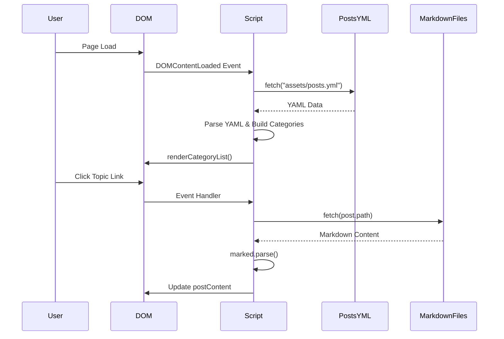
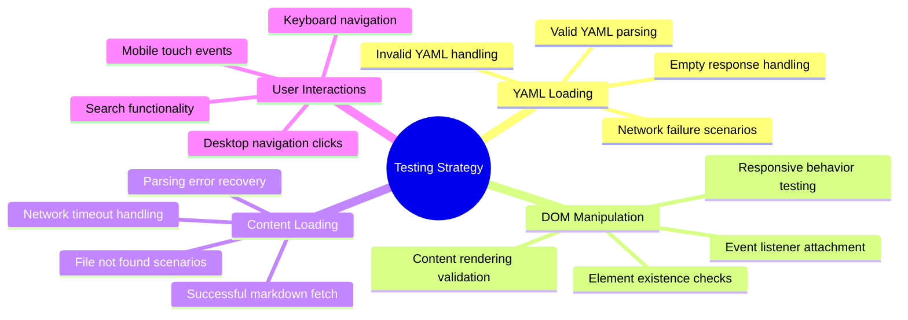

# Topic Display and Loading Fix Design

## Overview
This design document addresses critical issues with topic visibility and content loading in the AD Tech Blog application. Users are experiencing two main problems:
1. Topics are not visible in desktop view (sidebar appears blank)
2. Topic content fails to load properly on mobile devices, showing only the welcome message

## Architecture

### Current Content Loading Flow


### Issue Analysis

#### Problem 1: Topics Not Visible in Desktop View
**Root Cause**: The `renderCategoryList()` method may be failing silently or the DOM elements are not being properly populated.

**Symptoms**:
- Empty sidebar navigation
- No categories or post links displayed
- No error messages visible to user

#### Problem 2: Content Loading Failure on Mobile
**Root Cause**: The `loadPost()` method is not properly handling the markdown file fetching or parsing.

**Symptoms**:
- Welcome message persists after topic selection
- Actual post content doesn't load
- Loading spinner may appear but content doesn't update

## Component Architecture

### Enhanced Error Handling System
```mermaid
flowchart TD
    A[YAML Loading] --> B{YAML Valid?}
    B -->|No| C[Display Error Message]
    B -->|Yes| D[Parse Categories]
    D --> E{Categories Found?}
    E -->|No| F[Show "No Topics" Message]
    E -->|Yes| G[Render Topic List]
    G --> H[User Clicks Topic]
    H --> I{Valid Path & Title?}
    I -->|No| J[Log Error & Return]
    I -->|Yes| K[Fetch Markdown]
    K --> L{Fetch Successful?}
    L -->|No| M[Show Retry Button]
    L -->|Yes| N[Parse & Display Content]
    
    style C fill:#ffcccc
    style F fill:#fff2cc
    style J fill:#ffcccc
    style M fill:#ffcccc
```

### Debugging and Monitoring Components

#### Console Logging System
- **Initialization Logs**: Track script startup and DOM element detection
- **Data Loading Logs**: Monitor YAML parsing and content fetching
- **Error Logs**: Capture and report all failure points
- **User Action Logs**: Track navigation and interaction events

#### Error Recovery Mechanisms
- **Graceful Degradation**: Fallback content when posts can't be loaded
- **Retry Functionality**: Allow users to retry failed operations
- **Network Detection**: Handle offline/online states
- **Validation Checks**: Verify data integrity before processing

## Data Models & Validation

### Posts Configuration Validation
```typescript
interface Post {
  title: string;          // Required, non-empty
  path: string;           // Required, valid file path
  category: string;       // Required, non-empty
}

interface ValidationResult {
  isValid: boolean;
  errors: string[];
  warnings: string[];
}
```

### Content Loading State Management
```typescript
interface LoadingState {
  isLoading: boolean;
  currentPost: Post | null;
  error: Error | null;
  retryCount: number;
}
```

## Business Logic Layer

### Enhanced Content Manager
The `ResponsiveLayoutManager` class needs the following improvements:

#### 1. Robust Initialization
- Verify all required DOM elements exist
- Implement fallback behavior for missing elements
- Add comprehensive error logging

#### 2. Data Validation
- Validate YAML structure before processing
- Check for required post properties
- Handle malformed or missing data gracefully

#### 3. Content Loading Reliability
- Add timeout handling for fetch requests
- Implement exponential backoff for retries
- Provide clear user feedback during loading states

#### 4. Mobile-Specific Handling
- Ensure proper event delegation for mobile interactions
- Handle touch events correctly
- Optimize for mobile network conditions

## Testing Strategy

### Unit Testing Scenarios


### Integration Testing
- End-to-end content loading workflows
- Cross-device compatibility verification
- Network condition simulation
- Error recovery path validation

### Manual Testing Checklist
- [ ] Topics load correctly in desktop view
- [ ] Topic navigation works on mobile devices
- [ ] Content displays properly after selection
- [ ] Error messages appear when appropriate
- [ ] Retry functionality works as expected
- [ ] Search feature remains functional
- [ ] Table of contents generates correctly

## Implementation Fixes

### Critical Code Changes Required

#### 1. Enhanced DOM Element Verification
```javascript
// Add comprehensive element checking
const requiredElements = {
  categoryList: 'categoryList',
  postContent: 'postContent', 
  searchInput: 'searchInput'
};

function validateDOMElements() {
  const missing = [];
  Object.entries(requiredElements).forEach(([key, id]) => {
    if (!document.getElementById(id)) {
      missing.push(id);
    }
  });
  
  if (missing.length > 0) {
    console.error('Missing required DOM elements:', missing);
    return false;
  }
  return true;
}
```

#### 2. Improved YAML Loading with Validation
```javascript
async function loadPostsWithValidation() {
  try {
    const response = await fetch("assets/posts.yml");
    if (!response.ok) {
      throw new Error(`HTTP ${response.status}: ${response.statusText}`);
    }
    
    const yamlText = await response.text();
    const posts = jsyaml.load(yamlText);
    
    // Validate posts structure
    const validationResult = validatePosts(posts);
    if (!validationResult.isValid) {
      throw new Error(`Invalid posts configuration: ${validationResult.errors.join(', ')}`);
    }
    
    return posts;
  } catch (error) {
    console.error('Failed to load posts:', error);
    throw error;
  }
}
```

#### 3. Robust Content Loading
```javascript
async function loadPostContent(path, title) {
  const maxRetries = 3;
  let retryCount = 0;
  
  while (retryCount < maxRetries) {
    try {
      const controller = new AbortController();
      const timeoutId = setTimeout(() => controller.abort(), 10000); // 10s timeout
      
      const response = await fetch(path, { 
        signal: controller.signal 
      });
      
      clearTimeout(timeoutId);
      
      if (!response.ok) {
        throw new Error(`HTTP ${response.status}: ${response.statusText}`);
      }
      
      const markdown = await response.text();
      return marked.parse(markdown);
      
    } catch (error) {
      retryCount++;
      console.warn(`Attempt ${retryCount} failed for ${path}:`, error);
      
      if (retryCount >= maxRetries) {
        throw new Error(`Failed to load content after ${maxRetries} attempts: ${error.message}`);
      }
      
      // Exponential backoff
      await new Promise(resolve => setTimeout(resolve, Math.pow(2, retryCount) * 1000));
    }
  }
}
```

#### 4. Enhanced Error Display
```javascript
function showContentError(error, retryCallback) {
  const errorHtml = `
    <div class="alert alert-danger m-4" role="alert">
      <div class="d-flex align-items-center mb-3">
        <i class="bi bi-exclamation-triangle-fill text-danger me-2 fs-4"></i>
        <h4 class="alert-heading mb-0">Content Loading Error</h4>
      </div>
      <p class="mb-3">${error.message}</p>
      <div class="d-flex gap-2">
        <button class="btn btn-danger" onclick="location.reload()">
          <i class="bi bi-arrow-clockwise me-2"></i>Reload Page
        </button>
        <button class="btn btn-outline-danger" onclick="(${retryCallback})()">
          <i class="bi bi-arrow-repeat me-2"></i>Try Again
        </button>
      </div>
    </div>
  `;
  
  postContent.innerHTML = errorHtml;
}
```

## Middleware & Interceptors

### Request Interceptor
- Add consistent error handling across all fetch requests
- Implement request timeout management
- Add retry logic with exponential backoff
- Log all network requests for debugging

### Response Interceptor  
- Validate response content types
- Handle HTTP error status codes consistently
- Parse response data safely
- Cache successful responses where appropriate

### Event Interceptor
- Capture and log all user interactions
- Add performance timing measurements
- Implement global error boundaries
- Handle network connectivity changes