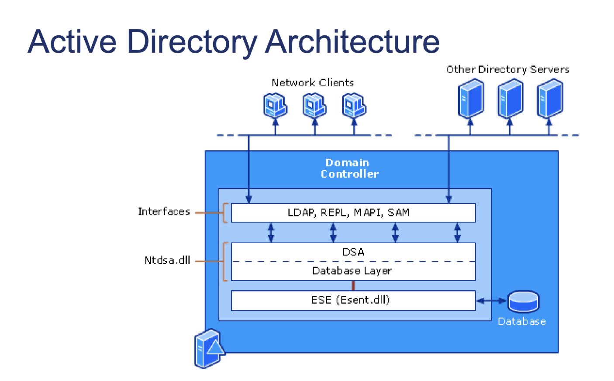

# **![][image1]**

## **Network Clients**

Machines, apps, and users that **talk to a Domain Controller (DC)** to authenticate (Kerberos/NTLM), query the directory (LDAP/GC), and locate services (DNS \+ LDAP).

## **Other Directory Servers**

Your **replication partners**—other DCs in the same domain/forest (or across sites). They exchange directory changes using the **REPL** interface (RPC).

## **Domain Controller (the big blue box)**

A Windows Server running the **Active Directory Domain Services (AD DS)** role. Inside it are layers/modules:

### **1\) Interfaces (protocol surface)**

Where external clients or other DCs connect:

* **LDAP — Lightweight Directory Access Protocol**

  * Read/write directory data, search, bind, modify, etc.

  * Default ports: **389** (LDAP), **636** (LDAPS/TLS).

  * Global Catalog (GC) searches (forest-wide) use **3268** (GC) and **3269** (GC over TLS).

* **REPL — Replication (DRS/DRSUAPI over RPC)**  
  * **DRS- Director of Replication Services**  
  *    
  * Multi-master replication engine between DCs.

  * Runs over **RPC Endpoint Mapper 135** \+ **dynamic RPC high ports** (by default 49152–65535).

  * Driven by the **KCC** (Knowledge Consistency Checker) and **ISTG** (Intersite Topology Generator).

  * Tracks changes via **USNs** (Update Sequence Numbers), up-to-dateness vectors, and tombstones/lingering object protection.

* **MAPI / NSPI — Messaging API / Name Service Provider Interface**

  * Historical/Exchange-related address book interface (Outlook/Exchange address book lookups).

  * Uses **RPC (135 \+ dynamic ports)** to talk to the Address Book service on a GC.

  * You rarely “admin” this directly unless troubleshooting Outlook address book lookups.

* **SAM — Security Accounts Manager (SAMR)**

  * The **SAM Remote (SAMR)** RPC interface that lets legacy/Windows components perform user/group lookups and account operations using SAM semantics.

  * On a DC, there isn’t a separate local SAM database—**AD replaces it**—but the **SAMR API surface** still exists for compatibility.

  * Runs over **RPC (135 \+ dynamic ports)**.

Closely related (not drawn but essential):

* **Kerberos (KDC)**: Authentication service inside LSASS. Port **88** (UDP/TCP).

* **Netlogon**: Secure channel and logon helper API used by domain members and DCs. RPC \+ SMB.

* **DNS**: AD-integrated DNS zone hosting SRV records so clients find DCs/GCs/KDCs. Port **53**.

### **2\) DSA — Directory System Agent**

The “brains” of AD inside the **LSASS** process, implemented by **ntdsa.dll**.

It:

* Enforces directory semantics (schema rules, constraints, referential integrity).

* Checks security (DACLs/SACLs) via LSASS’s Security Reference Monitor.

* Brokes all protocol requests (LDAP/REPL/MAPI/SAM) into database operations.

* Triggers/accepts **replication** and maintains naming contexts/partitions:

  * **Schema** (what objects/attributes exist and their rules)

  * **Configuration** (forest topology, sites, services)

  * **Domain** (users, groups, computers, OUs for that domain)

  * **Application partitions** (e.g., DNS application partitions)

* Maintains **Global Catalog (GC)** if the DC is a GC—stores a **partial attribute set** for forest-wide searching.

### **3\) Database Layer — ESE (Esent.dll) \+ NTDS.dit**

* **ESE (Extensible Storage Engine, “Jet Blue”) — esent.dll**

  * A transactional ISAM engine (write-ahead logging, checkpoints, crash recovery).

  * 8KB pages, B+-trees, single-writer/multi-reader behavior.

* **NTDS.dit**

  * The AD database file (default under %SystemRoot%\\NTDS\\NTDS.dit).

  * Holds all naming contexts/partitions stored on that DC.

  * Comes with **log files** (e.g., edb.log, edbxxxxx.log), **checkpoint** (edb.chk), and **temp.edb\`** for ESE.

  * **Esentutl.exe** and **NTDSUtil.exe** are the maintenance tools (integrity checks, semantic database analysis, offline defrag, IFM, etc.).

### **4\) ntdsa.dll (called out on the left)**

The AD “service” code library that **implements the DSA** and replication logic inside **lsass.exe**. Think of it as the layer that translates incoming protocol calls into ESE transactions.

---

## **How a typical operation flows**

1. A client binds over **LDAP** (389/636) →

2. **DSA (ntdsa.dll in LSASS)** authenticates/authorizes the caller and evaluates ACLs →

3. DSA commits reads/writes via **ESE** to **NTDS.dit** (transactional) →

4. Changes are scheduled and sent to other DCs via **REPL (DRSUAPI/RPC)**.

---

# **Acronym quick reference (cheat sheet)**

* **AD DS** — Active Directory Domain Services

* **LDAP** — Lightweight Directory Access Protocol (389/636)

* **LDAPS** — LDAP over TLS (636)

* **GC** — Global Catalog (3268/3269)

* **REPL/DRS/DRSUAPI** — Replication interfaces over RPC (135 \+ dynamic ports)

* **KCC/ISTG** — Build/optimize the replication topology (intra-site/inter-site)

* **USN** — Update Sequence Number (per-DC change counter used in replication)

* **MAPI/NSPI** — Messaging APIs for address book queries (RPC)

* **SAM/SAMR** — Security Accounts Manager (Remote) API (RPC)

* **DSA** — Directory System Agent (the AD brain inside LSASS, implemented by ntdsa.dll)

* **LSASS** — Local Security Authority Subsystem Service (process hosting AD/KDC/SAM/LSA)

* **ESE (esent.dll)** — Extensible Storage Engine (database engine)

* **NTDS.dit** — The AD database file

* **KDC** — Key Distribution Center (Kerberos Authentication Service/Ticket-Granting Service)

* **SRV records** — DNS service locator records clients use to find DC/GC/KDC

* **SYSVOL/DFSR** — Policies/scripts share replicated with DFS Replication (DFSR)

* **RootDSE** — Special read-only entry exposing server/forest capabilities (e.g., supportedLDAPVersion)

---

## **Common ports you’ll care about**

* **53** DNS

* **88** Kerberos (UDP/TCP)

* **135** RPC Endpoint Mapper

* **389 / 636** LDAP / LDAPS

* **445** SMB (SYSVOL/Netlogon, some RPC transports)

* **3268 / 3269** Global Catalog / GC over TLS

* **49152–65535** Dynamic RPC range (default on modern Windows; can be tuned)

---

## **Practical admin tips**

* **Replication health:** repadmin /showrepl, repadmin /replsummary.

* **Directory health:** dcdiag /v.

* **LDAP tests:** ldp.exe or PowerShell Get-ADObject, Get-ADUser \-LDAPFilter.

* **Database checks:** ntdsutil (semantic db analysis), esentutl (integrity; offline defrag only when needed).

* **Ports/firewall:** Ensure 53, 88, 135, 389/636, 445, 3268/3269, and dynamic RPC are open between clients ↔ DCs and DC ↔ DC.
