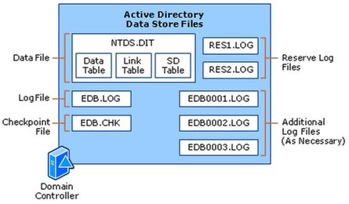

**AD DS (ESE/Jet) datastore** layout. Here’s what every box/file does and 

##  **— the database file**

* The actual **directory**—users, groups, computers, OUs, GPO containers, etc.

* Internally it has key tables (you’ll see these names in docs/tools):

  * **Data Table (datatable)**: one row per object; most attributes live here. Uses internal tags (DNT/PDNT/NCDNT) and indexes for fast search.

  * **Link Table (link\_table)**: stores **linked/multi-valued attributes** so they scale and replicate cleanly—e.g., member/memberOf, manager/directReports, member;range=….

  * **SD Table (sd\_table)**: **single-instance store for Security Descriptors** (ACLs). Identical ACLs are stored once and referenced, saving space.

Think: **datatable \= objects**, **link\_table \= relationships**, **sd\_table \= permissions**.  
---

## **2\)** 

## **EDB.LOG**

##  **— the current transaction log (10 MB)**

* AD is **transactional (write-ahead logging)**:

  1. A change is appended to **EDB.LOG**,

  2. The change is applied in memory,

  3. Later the dirty pages are flushed to **NTDS.DIT**,

  4. The **checkpoint** advances (see below).

* When **EDB.LOG** fills up, it’s **renamed** to the next numbered log and a fresh **EDB.LOG** is created.

## **3\)** 

## **EDB00001.LOG, EDB00002.LOG, …**

##  **— log generations**

* The sequence of **older 10 MB logs** created as EDB.LOG rolls over.

* Used for **crash recovery** (replay/roll-forward) and **backups/restores**.

* **They only truncate (delete)** after a successful *System State* backup (or VSS-aware AD backup). If you never back up, these can grow.

## **4\)** 

## **EDB.CHK**

##  **— the checkpoint file**

* A tiny pointer telling ESE, “All changes **up to here** are already in NTDS.DIT.”

* On startup after an unexpected shutdown, ESE replays logs **after** the checkpoint to bring the DB consistent.

* Not a backup; don’t delete it.

## **5\)** 

## **RES1.LOG & RES2.LOG**

##  **— reserve logs**

* Two **pre-allocated 10 MB** safety logs.

* If the disk suddenly fills, ESE can consume these to **shut down cleanly** (preventing DB corruption).

* After use, they are recreated on next start.

---

# **How a write actually flows (quick mental model)**

Change arrives → **append to EDB.LOG** → update memory pages → eventually **flush pages to NTDS.DIT** → **EDB.CHK** moves forward → **EDB.LOG** rolls to **EDB0000x.LOG** when full → backup truncates old logs.

---

# **Why this matters (ops tips)**

* **Watch sizes**: Keep **free disk** where logs and DB live (best practice: separate volumes).

* **Backups**: Do **regular System State** backups so old logs truncate.

* **Health checks**:

  * Paths & sizes:

    * ntdsutil "activate instance ntds" "files" "info" quit quit

    * Or simply check %SystemRoot%\\NTDS\\.

  * Database integrity/metadata (read-only): ntdsutil "activate instance ntds" "semantic database analysis" "go"

* **Compact/defrag**: Use **offline defrag** only when you truly need space back:

   ntdsutil "activate instance ntds" "files" "compact to \<path\>" (requires DC stopped/DS service down or DSRM).

* **Restore scenarios**: Logs are crucial for **crash recovery** and **authoritative/non-authoritative restores**.

---

## **One-liner meanings (cheat sheet)**

* **NTDS.DIT** – The AD database.

* **datatable** – Rows \= objects; columns \= attributes.

* **link\_table** – Group memberships & other linked/multi-valued attributes.

* **sd\_table** – De-duplicated ACLs (security descriptors).

* **EDB.LOG** – Current 10 MB transaction log.

* **EDB0000x.LOG** – Older log generations for recovery/backup.

* **EDB.CHK** – Checkpoint pointer for replay.

* **RES1/RES2.LOG** – Emergency logs for clean shutdown on low disk.
